# Professional developer

In this section we investigate the relationship between RSEs/RSDs and their own
experience in software development Understandably, we expect them having
several years of software development experience. However, as shown in previous
years, it is not necessarily reflected upon their own feeling of being
considered as professional.

Questions in this section:

* Do you consider yourself a professional software developer? (Yes/No)
* How many years of software development experience do you have? (integer)

## Australia

### How many professional developers?

| Professional developer for Australia   |   Count |   Percentage |
|:---------------------------------------|--------:|-------------:|
| Yes                                    |      43 |      46.2366 |
| No                                     |      50 |      53.7634 |

[Download CSV](../csv/proportion-professional-developer_australia.csv)

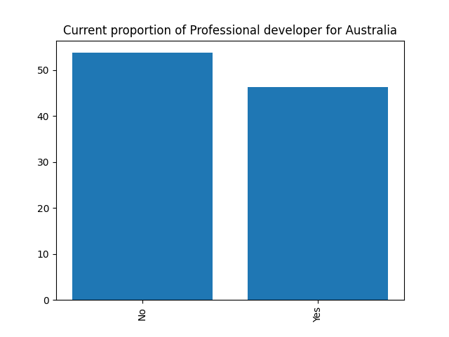

### Years of software development experience

| How many years of software development experience for Australia (without 95 percentile)   |   Results in 2018 |
|:------------------------------------------------------------------------------------------|------------------:|
| count                                                                                     |          90       |
| mean                                                                                      |          12.2089  |
| std                                                                                       |           8.15662 |
| min                                                                                       |           0       |
| 25%                                                                                       |           5       |
| 50%                                                                                       |          10       |
| 75%                                                                                       |          20       |
| max                                                                                       |          28       |

[Download CSV](../csv/summary-years-professional-developer_australia.csv)

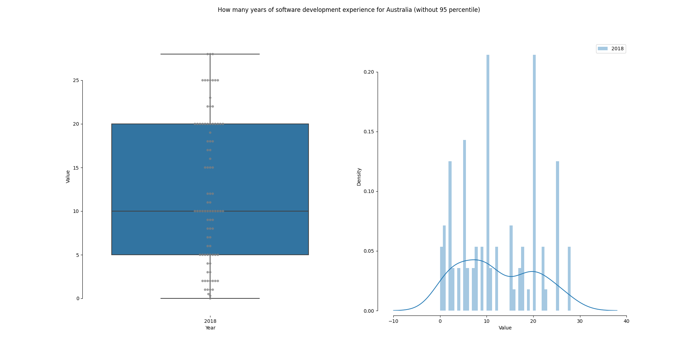

## Germany

### How many professional developers?

| Professional developer for Germany   |   Count |   Percentage |   Percentage in 2017 |   Difference with previous year |
|:-------------------------------------|--------:|-------------:|---------------------:|--------------------------------:|
| Yes                                  |     150 |      47.3186 |              42.7692 |                         4.54938 |
| No                                   |     167 |      52.6814 |              57.2308 |                        -4.54938 |

[Download CSV](../csv/proportion-professional-developer_germany.csv)

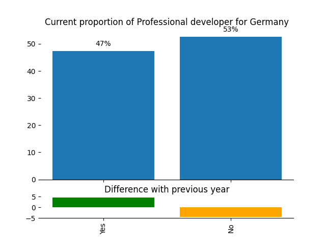

### Years of software development experience

| How many years of software development experience for Germany (without 95 percentile)   |   Results in 2018 |   Results in 2017 |
|:----------------------------------------------------------------------------------------|------------------:|------------------:|
| count                                                                                   |         313       |         304       |
| mean                                                                                    |           9.16374 |           9.38322 |
| std                                                                                     |           6.23297 |           6.23934 |
| min                                                                                     |           0       |           0       |
| 25%                                                                                     |           4       |           5       |
| 50%                                                                                     |           8       |           8       |
| 75%                                                                                     |          13       |          13       |
| max                                                                                     |          28       |          28       |

[Download CSV](../csv/summary-years-professional-developer_germany.csv)

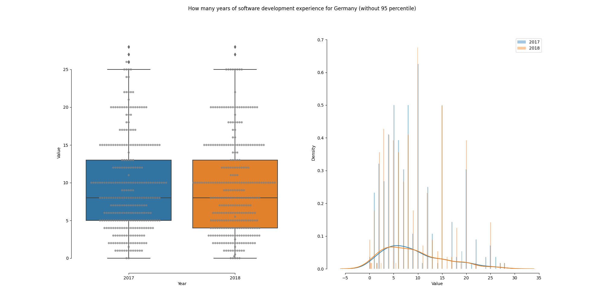

## Netherlands

### How many professional developers?

| Professional developer for Netherlands   |   Count |   Percentage |   Percentage in 2017 |   Difference with previous year |
|:-----------------------------------------|--------:|-------------:|---------------------:|--------------------------------:|
| Yes                                      |      29 |       54.717 |              65.3333 |                        -10.6164 |
| No                                       |      24 |       45.283 |              34.6667 |                         10.6164 |

[Download CSV](../csv/proportion-professional-developer_netherlands.csv)

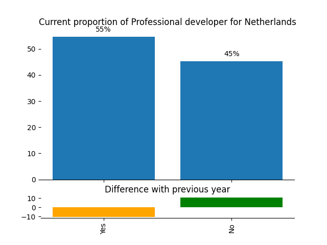

### Years of software development experience

| How many years of software development experience for Netherlands (without 95 percentile)   |   Results in 2018 |   Results in 2017 |
|:--------------------------------------------------------------------------------------------|------------------:|------------------:|
| count                                                                                       |          51       |          70       |
| mean                                                                                        |          10.951   |          11.1857  |
| std                                                                                         |           6.61079 |           7.02231 |
| min                                                                                         |           2       |           0       |
| 25%                                                                                         |           5       |           5       |
| 50%                                                                                         |          10       |          10       |
| 75%                                                                                         |          15       |          15       |
| max                                                                                         |          25       |          25       |

[Download CSV](../csv/summary-years-professional-developer_netherlands.csv)

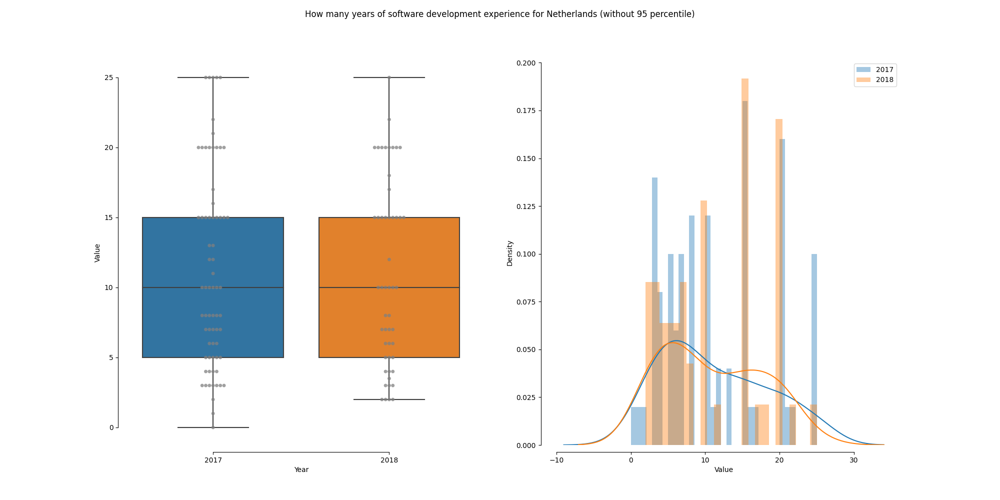

## New Zealand

### How many professional developers?

| Professional developer for New Zealand   |   Count |   Percentage |
|:-----------------------------------------|--------:|-------------:|
| Yes                                      |      24 |      66.6667 |
| No                                       |      12 |      33.3333 |

[Download CSV](../csv/proportion-professional-developer_new-zealand.csv)

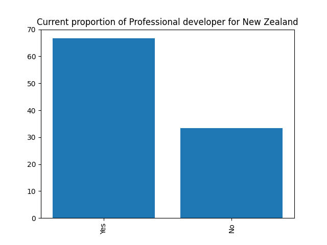

### Years of software development experience

| How many years of software development experience for New Zealand (without 95 percentile)   |   Results in 2018 |
|:--------------------------------------------------------------------------------------------|------------------:|
| count                                                                                       |          35       |
| mean                                                                                        |          14.5143  |
| std                                                                                         |           9.74792 |
| min                                                                                         |           1       |
| 25%                                                                                         |           5.5     |
| 50%                                                                                         |          15       |
| 75%                                                                                         |          21       |
| max                                                                                         |          30       |

[Download CSV](../csv/summary-years-professional-developer_new-zealand.csv)

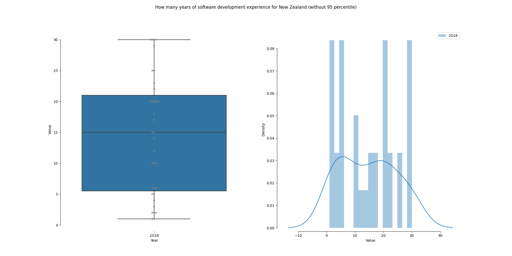

## South Africa

### How many professional developers?

| Professional developer for South Africa   |   Count |   Percentage |   Percentage in 2017 |   Difference with previous year |
|:------------------------------------------|--------:|-------------:|---------------------:|--------------------------------:|
| Yes                                       |       6 |      28.5714 |              26.3158 |                         2.25564 |
| No                                        |      15 |      71.4286 |              73.6842 |                        -2.25564 |

[Download CSV](../csv/proportion-professional-developer_south-africa.csv)

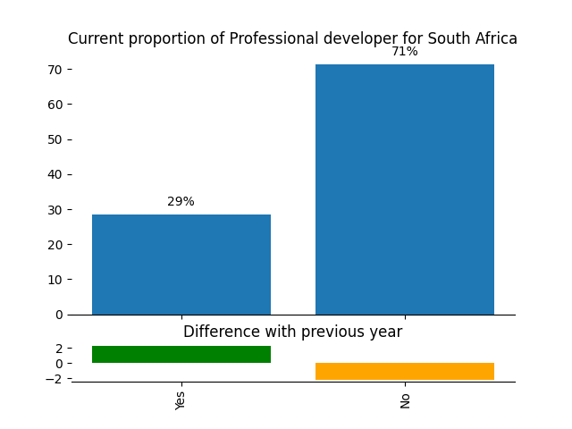

### Years of software development experience

| How many years of software development experience for South Africa (without 95 percentile)   |   Results in 2018 |   Results in 2017 |
|:---------------------------------------------------------------------------------------------|------------------:|------------------:|
| count                                                                                        |          21       |           18      |
| mean                                                                                         |           7.28571 |           15.3889 |
| std                                                                                          |           5.39577 |           11.7079 |
| min                                                                                          |           0       |            2      |
| 25%                                                                                          |           4       |            5.5    |
| 50%                                                                                          |           5       |           13.5    |
| 75%                                                                                          |          10       |           21.5    |
| max                                                                                          |          20       |           40      |

[Download CSV](../csv/summary-years-professional-developer_south-africa.csv)

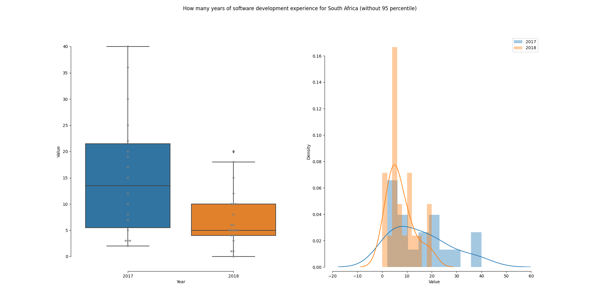

## United Kingdom

### How many professional developers?

| Professional developer for United Kingdom   |   Count |   Percentage |   Percentage in 2017 |   Difference with previous year |
|:--------------------------------------------|--------:|-------------:|---------------------:|--------------------------------:|
| Yes                                         |     143 |      62.7193 |              58.9431 |                         3.77621 |
| No                                          |      85 |      37.2807 |              41.0569 |                        -3.77621 |

[Download CSV](../csv/proportion-professional-developer_united-kingdom.csv)

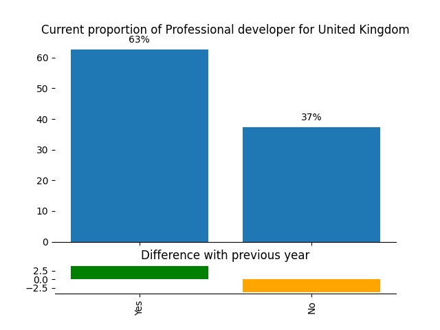

### Years of software development experience

| How many years of software development experience for United Kingdom (without 95 percentile)   |   Results in 2018 |   Results in 2017 |
|:-----------------------------------------------------------------------------------------------|------------------:|------------------:|
| count                                                                                          |         216       |         137       |
| mean                                                                                           |          10.7778  |          12.3796  |
| std                                                                                            |           6.61757 |           6.20144 |
| min                                                                                            |           0       |           1       |
| 25%                                                                                            |           5       |           7       |
| 50%                                                                                            |          10       |          12       |
| 75%                                                                                            |          16       |          17       |
| max                                                                                            |          28       |          27       |

[Download CSV](../csv/summary-years-professional-developer_united-kingdom.csv)

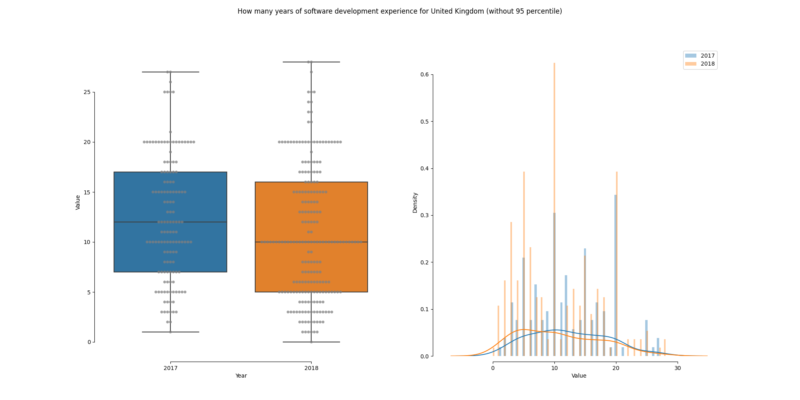

## United States

### How many professional developers?

| Professional developer for United States   |   Count |   Percentage |   Percentage in 2017 |   Difference with previous year |
|:-------------------------------------------|--------:|-------------:|---------------------:|--------------------------------:|
| Yes                                        |      90 |      63.8298 |                61.25 |                         2.57979 |
| No                                         |      51 |      36.1702 |                38.75 |                        -2.57979 |

[Download CSV](../csv/proportion-professional-developer_united-states.csv)

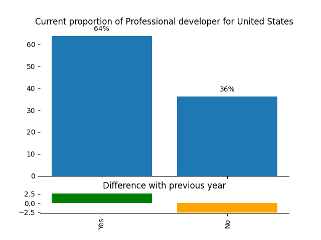

### Years of software development experience

| How many years of software development experience for United States (without 95 percentile)   |   Results in 2018 |   Results in 2017 |
|:----------------------------------------------------------------------------------------------|------------------:|------------------:|
| count                                                                                         |          139      |         149       |
| mean                                                                                          |           14.3165 |          12.8557  |
| std                                                                                           |           10.0355 |           8.84099 |
| min                                                                                           |            0      |           0       |
| 25%                                                                                           |            5      |           5       |
| 50%                                                                                           |           12      |          10       |
| 75%                                                                                           |           20      |          20       |
| max                                                                                           |           38      |          32       |

[Download CSV](../csv/summary-years-professional-developer_united-states.csv)

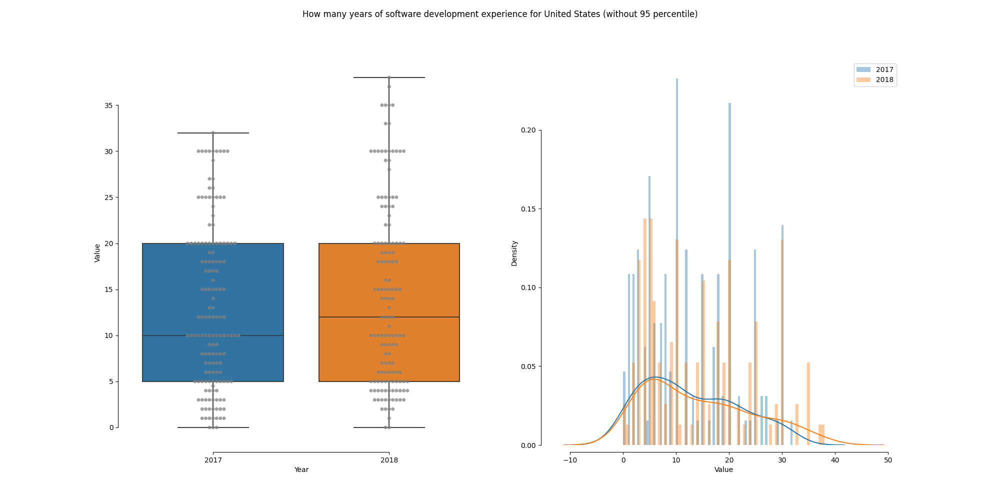

## World

### How many professional developers?

| Professional developer for World   |   Count |   Percentage |
|:-----------------------------------|--------:|-------------:|
| Yes                                |      22 |      42.3077 |
| No                                 |      30 |      57.6923 |

[Download CSV](../csv/proportion-professional-developer_world.csv)

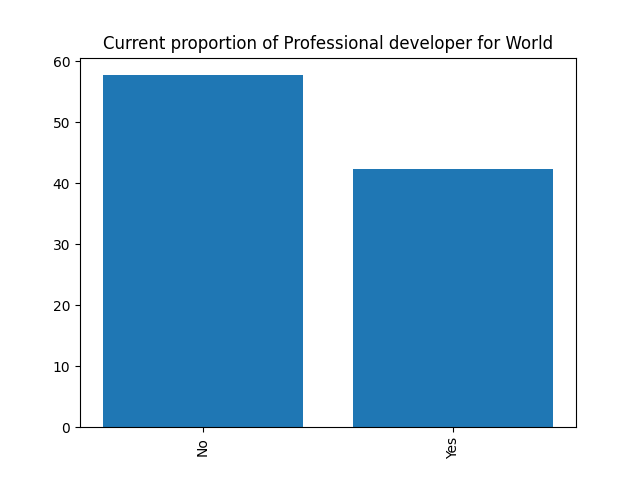

### Years of software development experience

| How many years of software development experience for World (without 95 percentile)   |   Results in 2018 |
|:--------------------------------------------------------------------------------------|------------------:|
| count                                                                                 |          52       |
| mean                                                                                  |           9.21154 |
| std                                                                                   |           5.25184 |
| min                                                                                   |           1       |
| 25%                                                                                   |           5       |
| 50%                                                                                   |          10       |
| 75%                                                                                   |          10.75    |
| max                                                                                   |          24       |

[Download CSV](../csv/summary-years-professional-developer_world.csv)

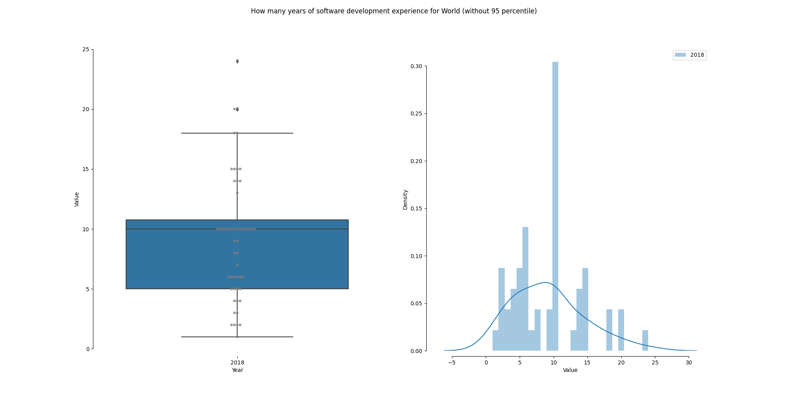

