# Publications and citations

RSEs is an hybrid role between a researcher and a software developer. We
investigated both of these aspects concerning publication and dissemination of
their work, one on the traditional aspect of it (publications and conference).

One essential aspect of career in academia is the publications and the
conferences to gain recognition. However, the role of RSE being less about
writing articles than creating the infrastructure and the software for the
article to exist, there is some fear that they will fail to have recognition
through the papers and conferences.

Questions in the section:

* In general, when your software contributes to a paper, are you acknowledged
  in that paper? (one choice)
* Have you presented your software work at a conference or workshop? (yes-no)
* At which conference(s)/workshop(s) have you presented your software work?
  (free text)

## Australia

### Acknowledgment in paper

| Acknowledgment in paper for Australia    |   Count |   Percentage |
|:-----------------------------------------|--------:|-------------:|
| Not mentioned at all                     |      18 |     20.2247  |
| Acknowledged in the main text            |       3 |      3.37079 |
| Acknowledged in acknowledgements section |      18 |     20.2247  |
| Named as co-author                       |      45 |     50.5618  |
| Named as main author                     |       5 |      5.61798 |

[Download CSV](../csv/acknowledgment-in-paper_australia.csv)

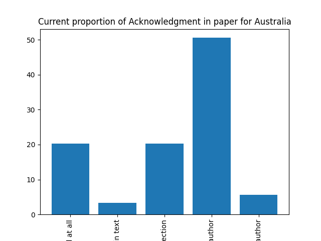

### Participation in conferences

| Did you participate in conference for Australia   |   Count |   Percentage |
|:--------------------------------------------------|--------:|-------------:|
| Yes                                               |      45 |      55.5556 |
| No                                                |      36 |      44.4444 |

[Download CSV](../csv/did-you-participate-in-conference_australia.csv)

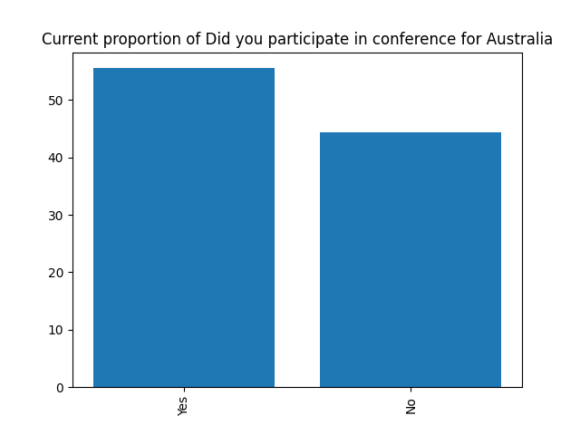

### Conference name

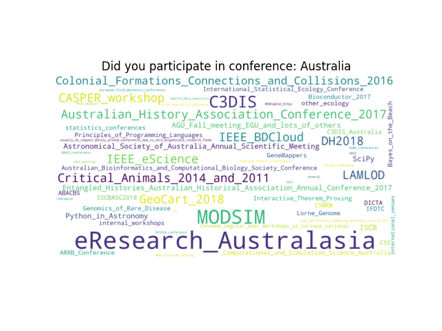

## Germany

### Acknowledgment in paper

| Acknowledgment in paper for Germany      |   Count |   Percentage |
|:-----------------------------------------|--------:|-------------:|
| Not mentioned at all                     |      63 |     21.3559  |
| Acknowledged in the main text            |      28 |      9.49153 |
| Acknowledged in acknowledgements section |      56 |     18.9831  |
| Named as co-author                       |     124 |     42.0339  |
| Named as main author                     |      24 |      8.13559 |

[Download CSV](../csv/acknowledgment-in-paper_germany.csv)

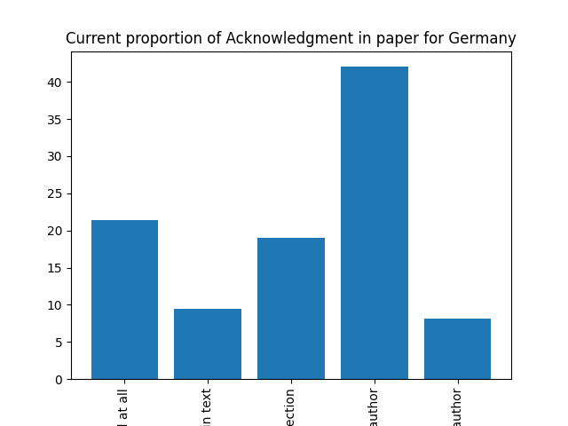

### Participation in conferences

| Did you participate in conference for Germany   |   Count |   Percentage |   Percentage in 2017 |   Difference with previous year |
|:------------------------------------------------|--------:|-------------:|---------------------:|--------------------------------:|
| Yes                                             |     150 |      54.3478 |              55.6667 |                        -1.31884 |
| No                                              |     126 |      45.6522 |              44.3333 |                         1.31884 |

[Download CSV](../csv/did-you-participate-in-conference_germany.csv)

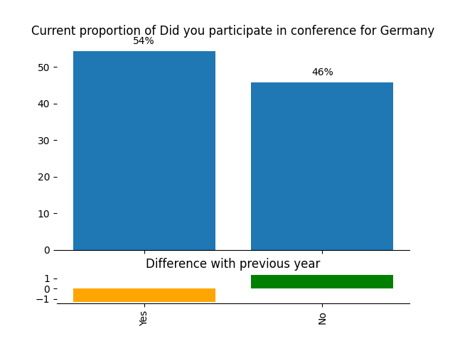

### Conference name

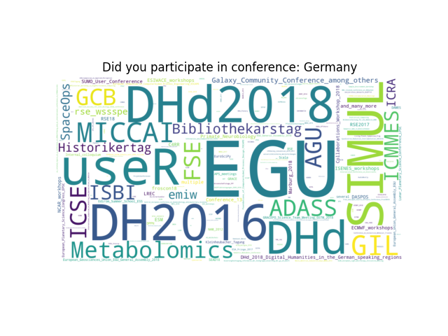

## Netherlands

### Acknowledgment in paper

| Acknowledgment in paper for Netherlands   |   Count |   Percentage |
|:------------------------------------------|--------:|-------------:|
| Not mentioned at all                      |      12 |     23.5294  |
| Acknowledged in the main text             |       7 |     13.7255  |
| Acknowledged in acknowledgements section  |       8 |     15.6863  |
| Named as co-author                        |      23 |     45.098   |
| Named as main author                      |       1 |      1.96078 |

[Download CSV](../csv/acknowledgment-in-paper_netherlands.csv)

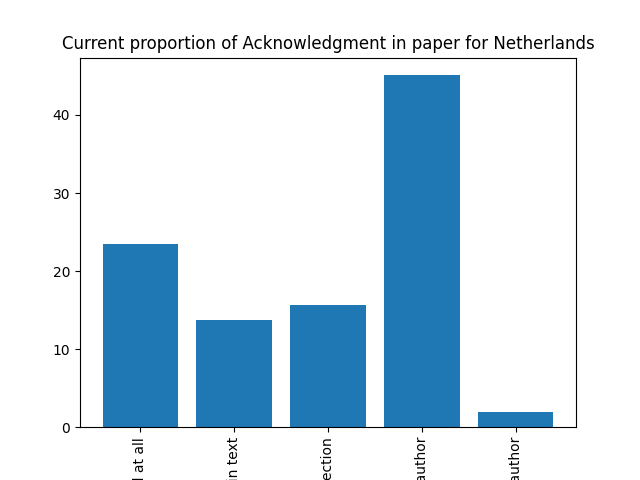

### Participation in conferences

| Did you participate in conference for Netherlands   |   Count |   Percentage |   Percentage in 2017 |   Difference with previous year |
|:----------------------------------------------------|--------:|-------------:|---------------------:|--------------------------------:|
| Yes                                                 |      26 |           52 |              78.0822 |                        -26.0822 |
| No                                                  |      24 |           48 |              21.9178 |                         26.0822 |

[Download CSV](../csv/did-you-participate-in-conference_netherlands.csv)

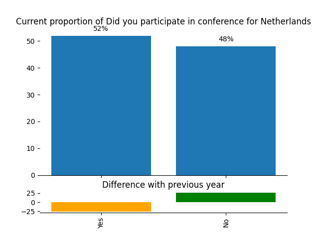

### Conference name

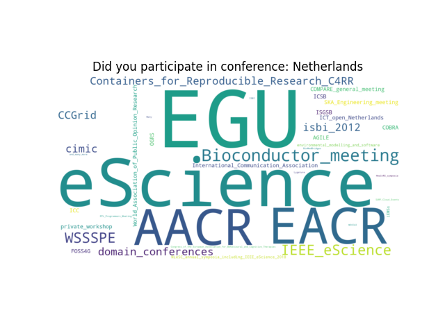

## New Zealand

### Acknowledgment in paper

| Acknowledgment in paper for New Zealand   |   Count |   Percentage |
|:------------------------------------------|--------:|-------------:|
| Not mentioned at all                      |       6 |     17.6471  |
| Acknowledged in the main text             |       3 |      8.82353 |
| Acknowledged in acknowledgements section  |       7 |     20.5882  |
| Named as co-author                        |      15 |     44.1176  |
| Named as main author                      |       3 |      8.82353 |

[Download CSV](../csv/acknowledgment-in-paper_new-zealand.csv)

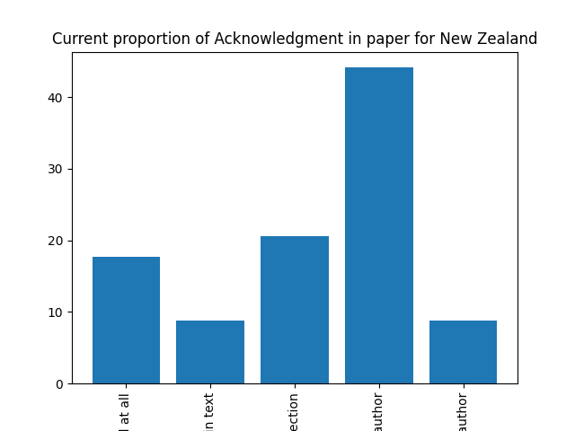

### Participation in conferences

| Did you participate in conference for New Zealand   |   Count |   Percentage |
|:----------------------------------------------------|--------:|-------------:|
| Yes                                                 |      18 |        56.25 |
| No                                                  |      14 |        43.75 |

[Download CSV](../csv/did-you-participate-in-conference_new-zealand.csv)

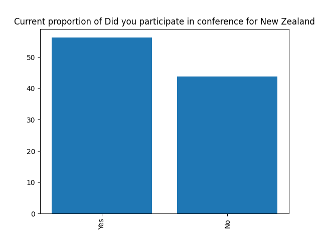

### Conference name

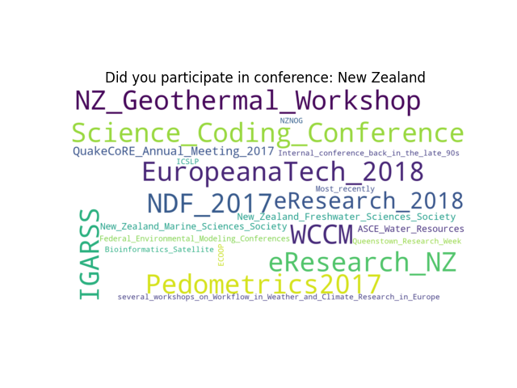

## South Africa

### Acknowledgment in paper

| Acknowledgment in paper for South Africa   |   Count |   Percentage |
|:-------------------------------------------|--------:|-------------:|
| Not mentioned at all                       |       5 |      23.8095 |
| Acknowledged in the main text              |       1 |       4.7619 |
| Acknowledged in acknowledgements section   |       4 |      19.0476 |
| Named as co-author                         |      10 |      47.619  |
| Named as main author                       |       1 |       4.7619 |

[Download CSV](../csv/acknowledgment-in-paper_south-africa.csv)

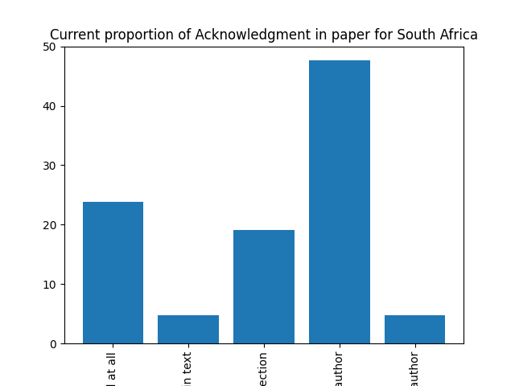

### Participation in conferences

| Did you participate in conference for South Africa   |   Count |   Percentage |   Percentage in 2017 |   Difference with previous year |
|:-----------------------------------------------------|--------:|-------------:|---------------------:|--------------------------------:|
| Yes                                                  |      12 |           60 |                31.25 |                           28.75 |
| No                                                   |       8 |           40 |                68.75 |                          -28.75 |

[Download CSV](../csv/did-you-participate-in-conference_south-africa.csv)

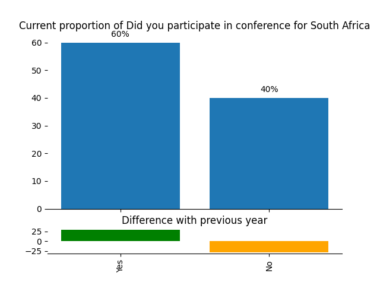

### Conference name

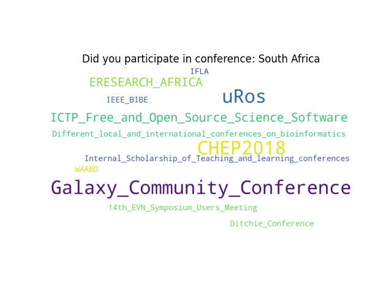

## United Kingdom

### Acknowledgment in paper

| Acknowledgment in paper for United Kingdom   |   Count |   Percentage |
|:---------------------------------------------|--------:|-------------:|
| Not mentioned at all                         |      41 |     19.1589  |
| Acknowledged in the main text                |      10 |      4.6729  |
| Acknowledged in acknowledgements section     |      42 |     19.6262  |
| Named as co-author                           |     110 |     51.4019  |
| Named as main author                         |      11 |      5.14019 |

[Download CSV](../csv/acknowledgment-in-paper_united-kingdom.csv)

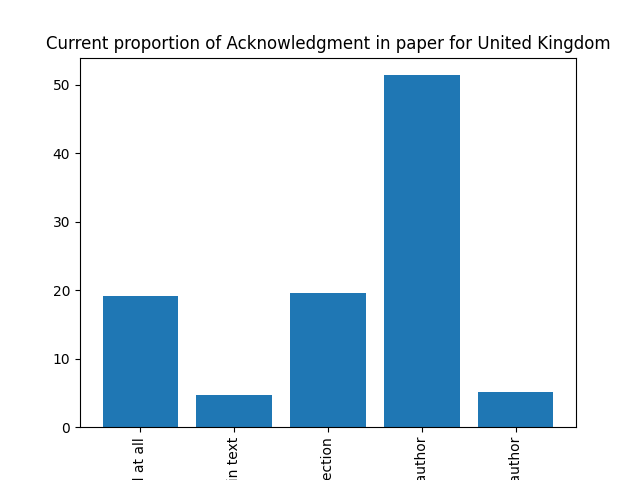

### Participation in conferences

| Did you participate in conference for United Kingdom   |   Count |   Percentage |   Percentage in 2017 |   Difference with previous year |
|:-------------------------------------------------------|--------:|-------------:|---------------------:|--------------------------------:|
| Yes                                                    |     121 |      58.1731 |              57.8261 |                         0.34699 |
| No                                                     |      87 |      41.8269 |              42.1739 |                        -0.34699 |

[Download CSV](../csv/did-you-participate-in-conference_united-kingdom.csv)

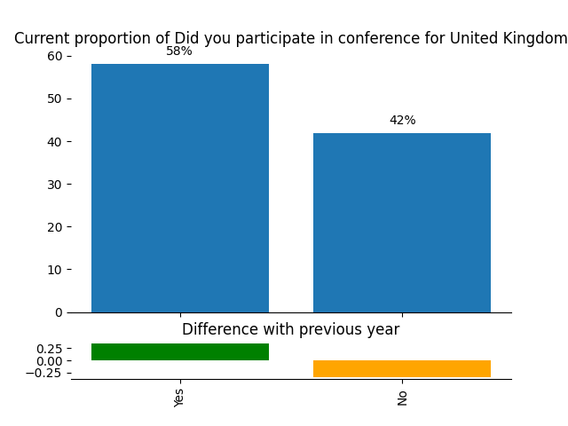

### Conference name

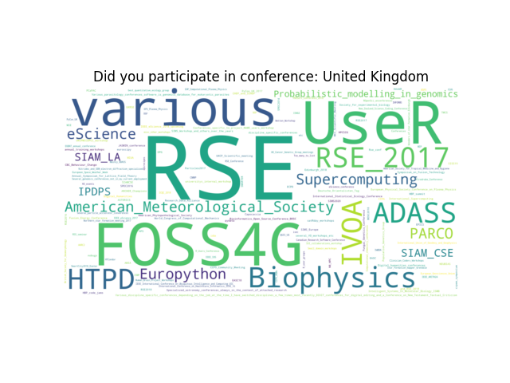

## United States

### Acknowledgment in paper

| Acknowledgment in paper for United States   |   Count |   Percentage |
|:--------------------------------------------|--------:|-------------:|
| Not mentioned at all                        |      30 |     21.7391  |
| Acknowledged in the main text               |      17 |     12.3188  |
| Acknowledged in acknowledgements section    |      23 |     16.6667  |
| Named as co-author                          |      65 |     47.1014  |
| Named as main author                        |       3 |      2.17391 |

[Download CSV](../csv/acknowledgment-in-paper_united-states.csv)

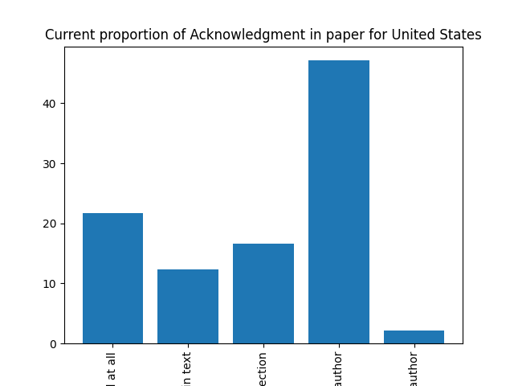

### Participation in conferences

| Did you participate in conference for United States   |   Count |   Percentage |   Percentage in 2017 |   Difference with previous year |
|:------------------------------------------------------|--------:|-------------:|---------------------:|--------------------------------:|
| Yes                                                   |      79 |      59.8485 |              65.9574 |                        -6.10896 |
| No                                                    |      53 |      40.1515 |              34.0426 |                         6.10896 |

[Download CSV](../csv/did-you-participate-in-conference_united-states.csv)

### Conference name

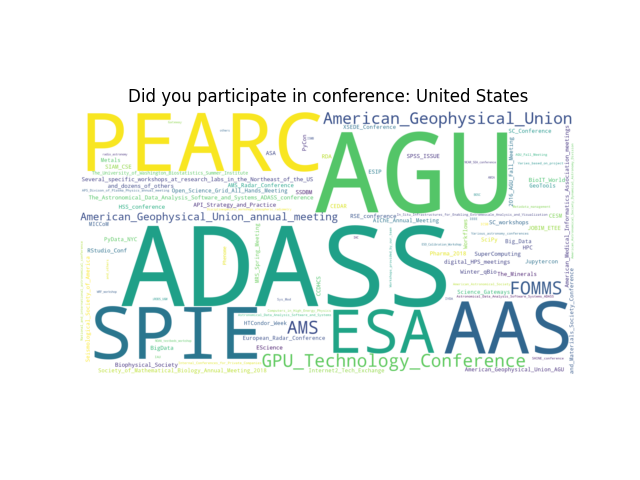

## World

### Acknowledgment in paper

| Acknowledgment in paper for World        |   Count |   Percentage |
|:-----------------------------------------|--------:|-------------:|
| Not mentioned at all                     |      10 |     24.3902  |
| Acknowledged in the main text            |       2 |      4.87805 |
| Acknowledged in acknowledgements section |       5 |     12.1951  |
| Named as co-author                       |      22 |     53.6585  |
| Named as main author                     |       2 |      4.87805 |

[Download CSV](../csv/acknowledgment-in-paper_world.csv)

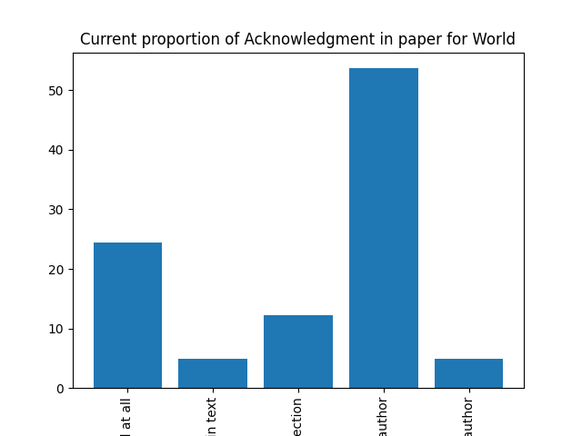

### Participation in conferences

| Did you participate in conference for World   |   Count |   Percentage |
|:----------------------------------------------|--------:|-------------:|
| Yes                                           |      21 |      53.8462 |
| No                                            |      18 |      46.1538 |

[Download CSV](../csv/did-you-participate-in-conference_world.csv)

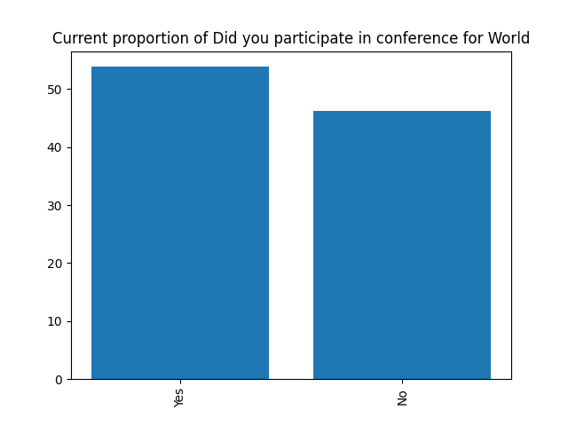

### Conference name

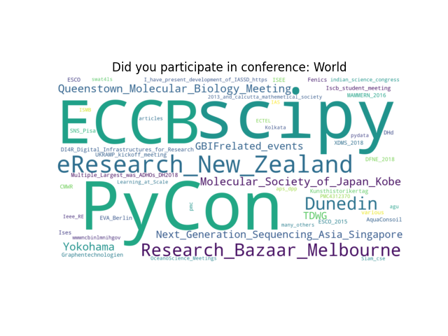

